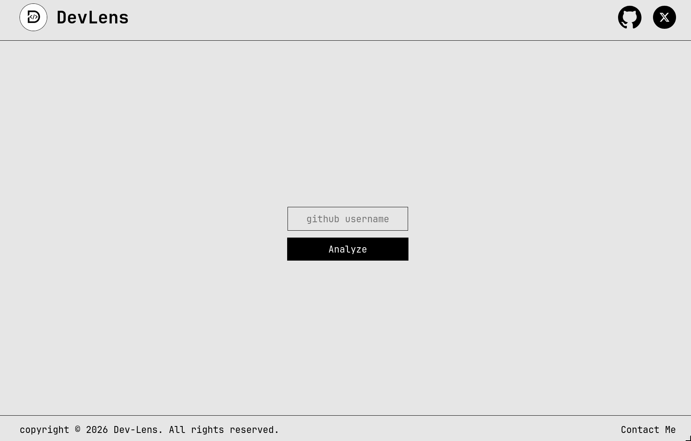
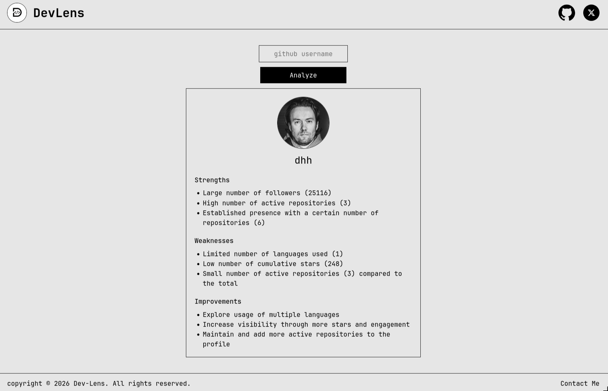
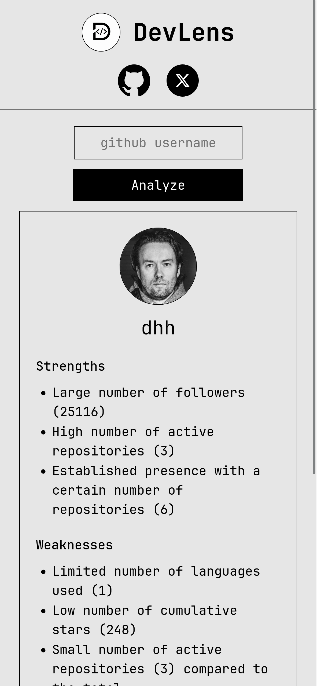

# DevLens

DevLens is an AI-powered GitHub profile analysis platform that evaluates public GitHub accounts using repository metadata, activity patterns, and GitHub statistics. The application combines GitHub API data with LLM-generated insights to provide strengths, weaknesses, and actionable improvement suggestions for developers.

---

## Features

* Analyze GitHub profiles by username
* Fetch real-time GitHub data using the GitHub API
* Display GitHub profile information
* Analyze repository statistics and activity
* Calculate total stars across repositories
* Identify primary programming languages
* Measure repository activity and consistency
* Generate AI-powered strengths assessment
* Generate AI-powered weaknesses assessment
* Generate AI-powered improvement suggestions
* Responsive and minimal user interface
* Error handling for invalid usernames and API failures

---

## Tech Stack

### Frontend

* React
* Vite
* Tailwind CSS
* JavaScript

### Backend

* Node.js
* Express.js

### APIs & Services

* GitHub REST API
* Groq API (Llama 3.1)

---

## Project Structure

```txt
DevLens/
│
├── Frontend/
│   ├── src/
│   ├── public/
│   ├── assets/
│   ├── components/
│   ├── package.json
│   └── vite.config.js
│
├── Backend/
│   ├── server.js
│   ├── package.json
│   └── .env
│
├── .gitignore
└── README.md
```

---

## Installation

### Clone the Repository

```bash
git clone git@github.com:DibyanshuMoura/DevLens.git
```

### Navigate to the Project Directory

```bash
cd DevLens
```

### Install Frontend Dependencies

```bash
cd Frontend
npm install
```

### Install Backend Dependencies

```bash
cd ../Backend
npm install
```

---

## Environment Variables

### Backend

Create a `.env` file inside the Backend directory.

```env
GROQ_API_KEY=your_groq_api_key
PORT=3000
```

### Frontend

Create a `.env` file inside the Frontend directory.

```env
VITE_API_URL=http://localhost:3000
```

---

## Run the Project

### Start Backend

```bash
cd Backend
npm start
```

### Start Frontend

```bash
cd Frontend
npm run dev
```

---

## Access the Application

Open your browser and visit:

```txt
http://localhost:5173
```

---

## Analysis Workflow

1. User enters a GitHub username
2. Frontend sends a request to the backend
3. Backend fetches GitHub profile and repository data
4. Repository statistics are processed
5. Data is sent to Groq's LLM for evaluation
6. AI generates strengths, weaknesses, and improvement suggestions
7. Results are returned to the frontend
8. DevLens displays the analysis report

---

## Example Data Analyzed

* Username
* Public repositories
* Followers
* Repository stars
* Programming languages
* Active repositories
* Profile activity patterns
* Repository distribution

---

## Screenshots

### Homepage



### Analysis Report



### Mobile View



---

## Future Improvements

* GitHub contribution graph analysis
* Skill scoring system
* Developer maturity score
* Repository quality assessment
* Resume readiness analysis
* Advanced analytics dashboard
* Export analysis as PDF
* Historical profile tracking
* Authentication and saved reports

---

## Learning Outcomes

This project helped in understanding:

* React component architecture
* State management with Hooks
* Environment variable management
* REST API integration
* Backend development with Express.js
* Error handling and validation
* LLM API integration
* GitHub API usage
* Frontend and backend separation
* Deployment workflows

---

## Contributing

Pull requests are welcome. For major changes, please open an issue first to discuss the proposed improvements.

---

## License

This project is licensed under the MIT License.

---

## Author

**Dibyanshu Moura**

* GitHub: https://github.com/DibyanshuMoura
* X: https://x.com/DibyanshuMoura

## Repository

**Github Repository**

* https://github.com/DibyanshuMoura/DevLens